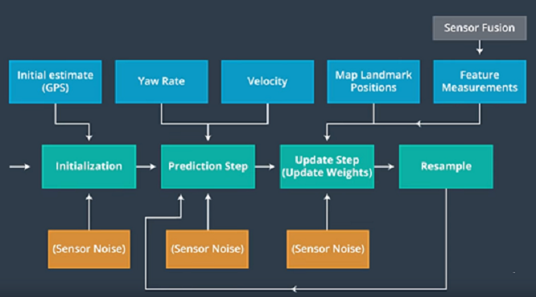

# Term2 - Project 3: Kidnapped Vehicle Project - Particle Filter
### Ajay Paidi

# Objective
The objective of this project is to implement a particle filter to accurately localize a car given map data, an initial GPS estimate (noisy), sensor and control data (noisy).

# File structure
- **ReadMe.md**: This file
- **main.cpp**: The main executable program that reads map data, control data and loops through the measurements for every time step and calls the particle filter to do the prediction, weight updates and resampling. This file is used as provided without any modifications.
- **particle_filter.h** and **particle_filter.cpp**: Contains the implementation of the particle filter.
- **helper_functions.h**: Contains utility functions to read data and compute error metrics.S

# Description

Here is the flowchart describing the implemented particle filter algorithm

# Results

The cumulative mean weighted error for the provided dataset was
x: 0.126
y:0.126
yaw:0.004

The approximate runtime of the algorithm was around 28 seconds (Dell Windows laptop - core i7)
